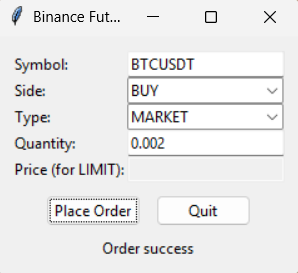
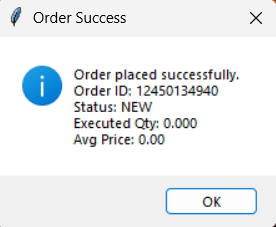

# Binance Futures Bot

**Overview**
- **Description:** A small Binance Futures testnet trading bot with two ways to place orders: a CLI (`cli.py`) and a lightweight Tkinter GUI (`lightweight_ui.py`).

**Requirements**
- **Python:** 3.8+ recommended.
- **Dependencies:** Install from `requirements.txt`:

```bash
pip install -r requirements.txt
```

**Quick Start**

- **CLI:** Run orders from your terminal using `cli.py`:

```bash
python cli.py --symbol BTCUSDT --side BUY --type MARKET --quantity 0.002
```

- Example LIMIT order (sell at a specific price):

```bash
python cli.py --symbol BTCUSDT --side SELL --type LIMIT --quantity 0.002 --price 80000
```

- **Lightweight GUI:** Start the Tkinter UI and place orders interactively:

```bash
python lightweight_ui.py
```

**Screenshots**

Lightweight UI - main form:



Lightweight UI - order result dialog:



Place your screenshots in the `images/` folder with the names above.

**How it works**
- **Validation:** Both interfaces use the same validators in `bot/validators.py` to ensure `side`, `type`, `quantity`, and `price` are valid before attempting placement.
- **Ordering:** Both call `OrderService.place_order` (via `bot/orders.py`) which in turn uses `BinanceFuturesClient` from `bot/client.py`.

**Notes & Troubleshooting**
- If Tkinter is missing (rare on standard Python installs), install the platform-specific package or use the system Python that includes Tk.
- Check `logs/` for runtime logs configured by `bot/logging_config.py`.

**Files**
- `cli.py` — Terminal-based order placement.
- `lightweight_ui.py` — Tkinter graphical interface.
- `bot/` — Core client, validators, and order logic.

**License**
- MIT-style (check repository owner for exact terms).

